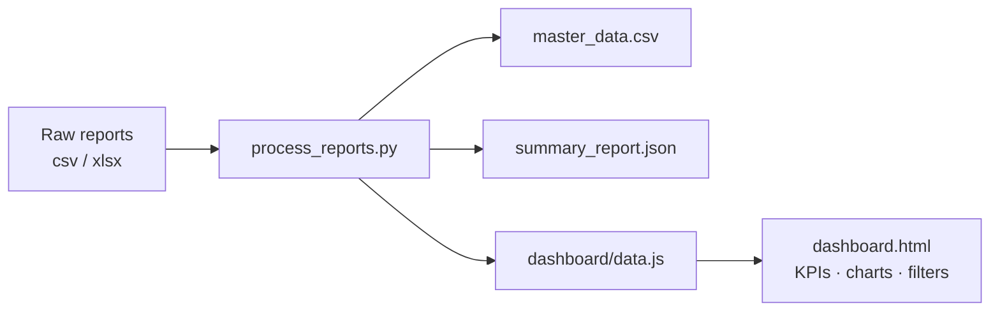
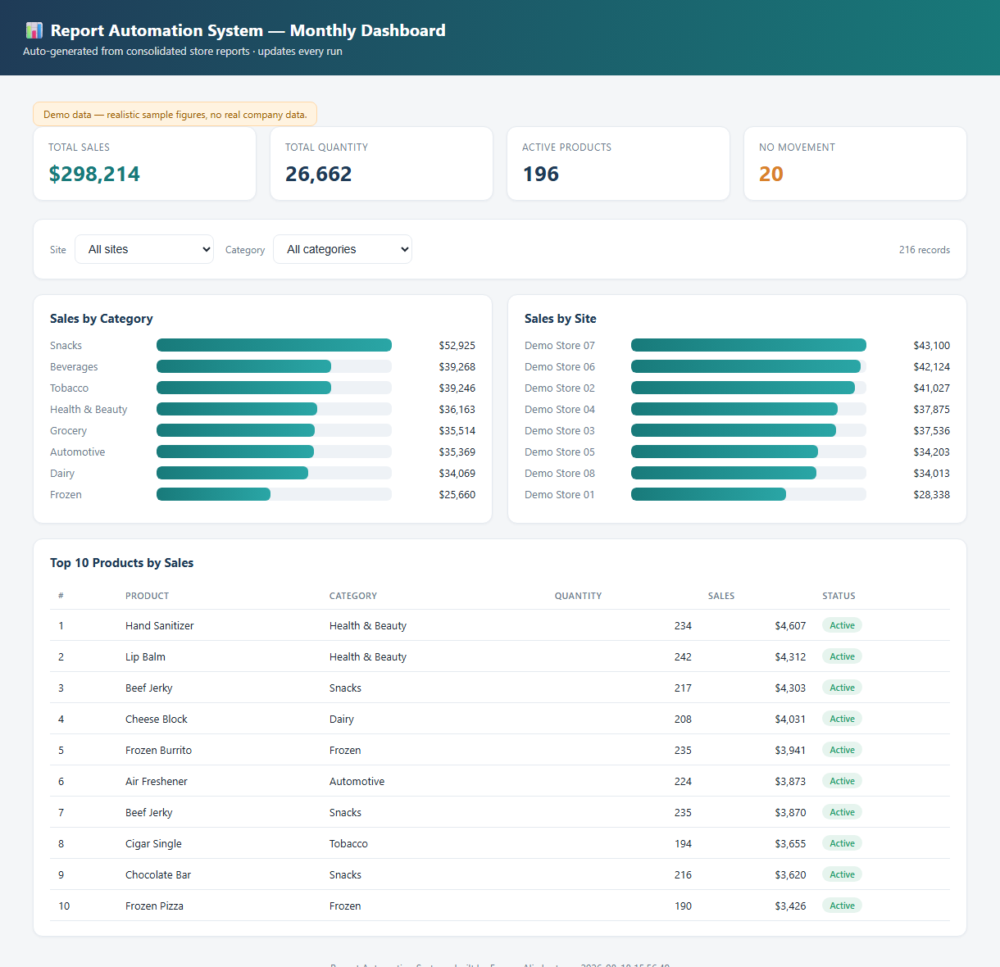

# 📊 Business Report Automation System

**Turn a folder of messy monthly store reports into one clean master dataset and an interactive KPI dashboard — in a single command.**

🔗 **Live demo:** https://report-automation-dashboard.vercel.app
*(runs on fully anonymized sample data — `Demo Store 01…08`, generic products, no real business figures)*

---

## 🎯 Problem

Multi-site retail and back-office finance teams live on the same monthly ritual: gather a dozen store/commissary exports, reconcile columns that never quite line up (`Qty` vs `Quantity`, `Site` vs `Location`, `Amount` vs `Sales`), paste everything into one workbook, then hand-build the summary numbers for management. It is slow, it is repeated every single month, and every manual copy-paste is a chance to introduce a silent error into the numbers leadership actually decides on.

## 💡 Solution

Drop the raw reports into one folder and run one command. The system ingests every `.csv`/`.xlsx` file, normalizes the inconsistent headers into a single canonical schema, consolidates them into one tidy master table, computes the management KPIs, and regenerates a self-contained interactive dashboard — no server, no database, no manual reconciliation.

## 🏗️ Architecture

A deliberately simple, portable pipeline: files in → Python processing → static dashboard out.

```
01_input_reports/          ← drop monthly reports here (.csv / .xlsx / .xlsm)
        │
        ▼
process_reports.py         ← 1. read every file  (csv stdlib / openpyxl for Excel)
                             2. map messy headers → canonical schema (ALIASES table)
                             3. keep only rows with a real Site/Product signal
                             4. consolidate + compute KPIs
        │
        ├── 03_output/master_data_<timestamp>.csv   → tidy consolidated master table
        ├── 03_output/summary_report.json           → run summary (totals, KPIs)
        └── dashboard/data.js                        → window.REPORT_DATA payload
                    │
                    ▼
        dashboard/dashboard.html   ← open in any browser (fully static, zero deps)
```



**Real files that do the work:**

| File | Role |
|------|------|
| `process_reports.py` | Core processor — ingest, header normalization, consolidation, KPI computation, output generation, and a deterministic demo-data generator (`--demo`) |
| `dashboard/dashboard.html` | Self-contained dashboard — KPI cards, bar charts, donut, top-10 table, Site/Category filters (vanilla JS + inline SVG) |
| `dashboard/data.js` | Generated data payload (`window.REPORT_DATA`) that keeps the dashboard static and `file://`-openable |
| `automation/*.ps1` | Windows orchestration — run, process-only, file-watcher, and a daily scheduled task |

## ✨ Key Features

- **Header normalization** — an `ALIASES` map folds real-world header variants (`Qty`/`Quantity`/`Units`, `Site`/`Location`/`Store`, `Amount`/`Cost`/`Sales`, …) into a fixed 6-column canonical schema, instead of naively dumping every sheet.
- **Multi-format ingest** — CSV via the standard library; `.xlsx`/`.xlsm` via optional `openpyxl`, reading every worksheet.
- **Signal filtering** — rows are kept only when they carry a real `Site` or `Product` value, so blank/footer rows never pollute the master table.
- **KPI engine** — total sales, total quantity, active vs. no-movement product counts, written to both JSON and the dashboard payload.
- **Interactive dashboard** — Sales by Category, Sales by Site, Category Share donut, and a Top-10 Products table, all re-filterable live by Site and Category. No build step, no CDN, no runtime dependencies.
- **Three ways to run** — manual one-shot, a `FileSystemWatcher` that auto-processes new drops, or a daily 8 AM Windows scheduled task.
- **Portable by design** — every path resolves relative to the script, so the project runs from any location with no hard-coded user paths.

## 🛠️ Tech Stack

- **Python 3** — core processing on the standard library (`csv`, `json`, `pathlib`); **optional** `openpyxl>=3.1` only for Excel input.
- **Vanilla JS + inline SVG** — the dashboard renders bars and the donut chart by hand; zero front-end frameworks, zero runtime dependencies.
- **PowerShell** — Windows automation and scheduling.
- **Vercel** — hosts the live static dashboard.

## 🧠 Engineering Decisions

- **Canonical schema over ad-hoc merging.** The hard part of real reporting isn't summing numbers — it's that every source spells its columns differently. Centralizing that in one extensible `ALIASES` table means supporting a new report format is a one-line change, not a rewrite.
- **Static dashboard, no backend.** Processing emits a plain `data.js` payload the HTML reads directly, so the dashboard opens over `file://` or any static host (like Vercel) with nothing to deploy or secure. For a report that ships once a month, a server would be pure overhead.
- **Deterministic demo data.** `--demo` uses a seeded linear-congruential generator, so the public sample is reproducible and review-friendly — and, critically, contains no real company data.
- **Stdlib-first.** CSV needs zero installs; `openpyxl` is imported lazily and only when an Excel file is actually encountered, so the common path has no dependencies at all.

## 📈 Results / Demo

🔗 **Live dashboard:** https://report-automation-dashboard.vercel.app

The live demo runs the anonymized sample end-to-end: **216 consolidated records** across **8 demo stores** and **8 product categories**, with headline KPIs (total sales, quantity, active vs. no-movement products) and live Site/Category filtering — exactly what the pipeline produces from a real monthly drop, minus any real business data.

## 🖼️ Screenshot



## 🚀 Setup / Installation

```bash
# 1. (optional) install Excel support — CSV needs nothing extra
pip install -r requirements.txt

# 2. generate anonymized demo data + build the dashboard payload
python process_reports.py --demo

# 3. open the dashboard
#    dashboard/dashboard.html   (or the live demo link above)
```

Run on **real** reports by dropping them into `01_input_reports/` and running:

```bash
python process_reports.py
```

### Automation (Windows)

| Script | Purpose |
|--------|---------|
| `automation/Run_All.ps1` | Process reports **and** open the dashboard |
| `automation/Process_Reports.ps1` | Process only |
| `automation/File_Watcher.ps1` | Auto-process any new file added to the input folder |
| `automation/Create_Scheduled_Task.ps1` | Register a daily 8 AM run (run once, elevated) |

### Canonical schema

| Column | Description |
|--------|-------------|
| `Site` | Store / location |
| `Category` | Product group |
| `Product` | Item description |
| `Quantity` | Units moved |
| `Sales` | Sales / cost value |
| `Status` | `Active` or `No Movement` |

## 🔒 Security

- **No real business data.** This public repo ships **anonymized sample data only** — generic store names, generic products, deterministically generated figures.
- **Real data can't be committed by accident.** `.gitignore` blocks the entire `01_input_reports/` folder (except the tracked `*DEMO*` sample), all `03_output/` artifacts, logs, and every raw `*.xlsx`/`*.xlsm`/`*.xls` workbook as a safety net.
- **No secrets in code.** The pipeline reads local files only; any environment-specific configuration stays in the environment, never in the repo.

## 🗺️ Roadmap

- Additional input formats and richer header-alias coverage
- Historical / month-over-month trend views in the dashboard
- Cross-platform automation (currently Windows/PowerShell)
- Optional emailed summary on each scheduled run

## 📄 License

MIT — see [`LICENSE`](LICENSE).

---

*Built by **Furqan Ali** — Senior AI Engineer · finance & operations automation.*
